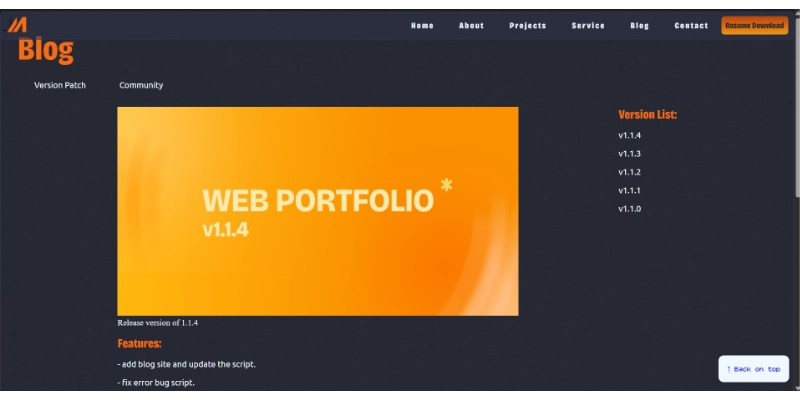

# New Release on 2026 webportfolio v1.1.4


### Features in `v1.1.4`
- add Blog site and update Script by [@JosephMorales28](https://github.com/JosephMorales28)
- fixed bugs on script by [@JosephMorales28](https://github.com/JosephMorales28)

### Authors and Buy me a Coffee

[@JosephMorales28](https://github.com/JosephMorales28)

### Installation
click the Assets on the release version of v1.1.4 in github release or on the code button Download ZIP release version of `v1.1.4`

### Run on Browser
Open VsCode Terminal `powershell`
```bash
   npm run dev
```
### Update on `main.js`
```javascript

else if (window.location.pathname.endsWith("blog.html")){
        const blogTitle="Blog";
        const blogLinks=[
            {label:"Version Patch", href:"/version_patch.html"},
            {label:"Community", href:"/community.html"}
        ];
        const blogversion=["v1.1.4","v1.1.3","v1.1.2","v1.1.1","v1.1.0"];

        const blogMenuItems=blogLinks.map((item)=>{
            return `<li><a href="${item.href}">${item.label}</a></li>`;
        }).join("");

        const blogversionlist=blogversion.map((item)=>{
            return `<li>${item}</li>`;
        }).join("");
        
        return `
           <main role="main">
              <div id="blog">
                 <h1>${blogTitle}</h1>
                 <ul id="blogmenu">
                    ${blogMenuItems}
                 </ul>
                 <div id="bloggrid">
                    <div id="blogleft">
                       <figure>
                          <picture>
                             <source srcset="img/banner/websiteportfoliov1.1.4.webp" type="image/webp">
                             
                          </picture>
                          <figcaption>Release version of 1.1.4</figcaption>
                       </figure>
                       <h2>Features:</h2>
                       <p>- add blog site and update the script.</p>
                       <p>- fix error bug script.</p>
                       <h2>Screenshot:</h2>
                       <figure>
                          <picture>
                             <source srcset="img/banner/screenshot_v1.1.4.webp" type="image/webp">
                             
                          </picture>
                          <figcaption>Screenshot version of 1.1.4</figcaption>
                       </figure>
                    </div>
                    <div id="blogright">
                        <h2>Version List:</h2>
                        <ul>
                            ${blogversionlist}
                        </ul>
                    </div>
              </div>
           </main>
        `;
    }
```
### Update on `nav.js`
```javascript
export function exp_nav_func(){

    if ( window.location.pathname === "/" || window.location.pathname.endsWith("index.html")) {

    const myName="Joseph Anthony V. Morales";
    const myPosition="Web Development | Graphic Design";
    const myBio="Hi, I'm Joseph, a passionate web developer and graphic designer based in the Philippines.";
    const imgAlt="profile picture";
    
    return `
         <nav role="navigation">
                <div class="profile">
                   <div class="profile-pic">
                       <picture>
                           <source srcset="../img/joseph2026_150x150.webp" media="(max-width:150px)" type="image/webp">
                           <source srcset="../img/joseph2026_300x300.webp" media="(max-width:300px)" type="image/webp">
                           
                       </picture>
                   </div>
                   <div class="profile-info">
                       <h1>${myName}</h1>
                       <h2>${myPosition}</h2>
                       <p>${myBio}</p>
                   </div>
                </div>
        </nav>
    `;
   }
   else if (window.location.pathname.endsWith("about.html")){
    return "";
   }
   else if (window.location.pathname.endsWith("project.html")){
    return "";
   }
   else if (window.location.pathname.endsWith("service.html")){
    return "";
   }
   else if (window.location.pathname.endsWith("blog.html")){
    return "";
   }
   else if (window.location.pathname.endsWith("contact.html")){
    return "";
   }
return "";
}

```